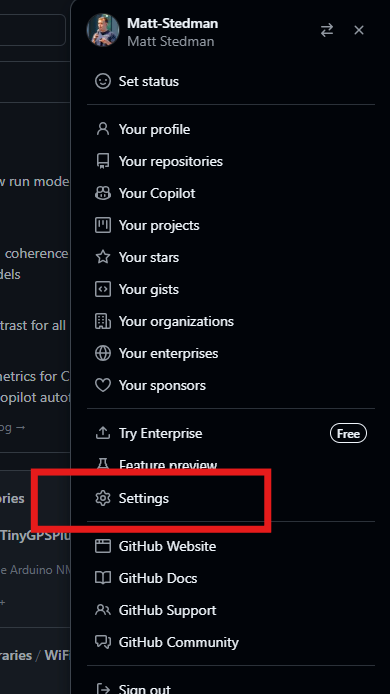
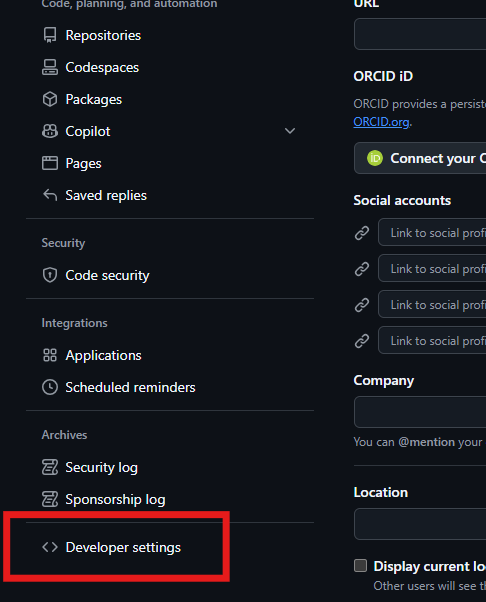
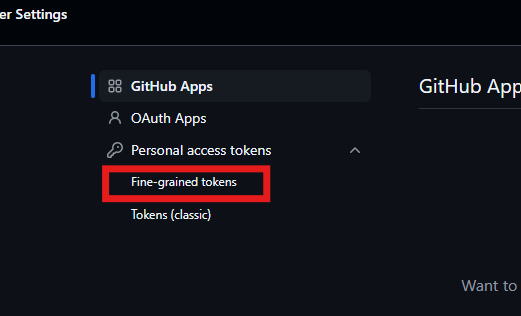
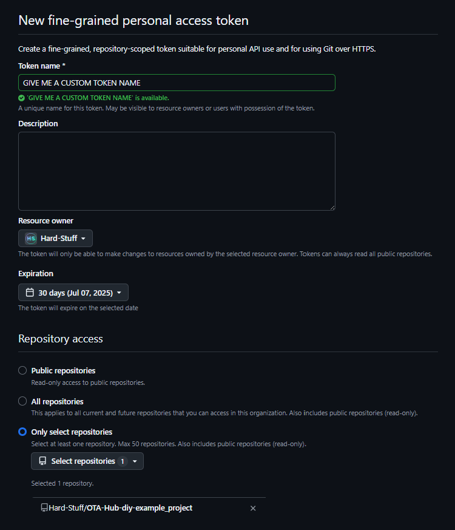
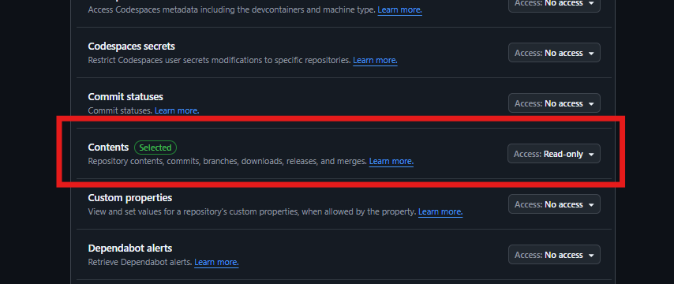

# Creating personal access tokens for private GitHub repos

OTA Hub DIY works with both your public and private repositories, pulling built firmware releases directly from GitHub and GitLab. If using a private repository, we need a Personal (or Fine Grain) Access Token (PAT) to represent you so devices can access your secure accoutn. [You can generate your PATs here](https://docs.github.com/en/authentication/keeping-your-account-and-data-secure/managing-your-personal-access-tokens), and/or follow the below steps to generate a new key.

## 1. Go to your GitHub Settings



## 2. Go to developer settings



## 3. Add a "Fine-grained tokens" (which is better for tighter security)



## 4. Define your token definitions:

- Give it a memorable and obvious name
- Set the expiration date for the token. Fine grain tokens only last a maximum of 1 year - we are exploring how we can work around this (or move to OTA Hub pro!)
- Fine-grain the token to work on **Only select repositories** - this means it'll not work on any other repos, hence tighter security.



## 5. ..and ensure that only "Contents -> Read-only" is set

- We only need the contents of the repo, i.e. the release contents
- We only need "Read-only" access, as the ESP32 will never be writing on the repo



## 6. Build and flash ONCE over USB prepending your PAT in the pio build flags

- Then, once created, you can dump the token in a `.token` file and run _(example for **Windows**)_: 
  ```powershell
  # windows
  $env:PLATFORMIO_BUILD_FLAGS = "-DOTAHUB_BEARER_TOKEN=\`"$((Get-Content .token -Raw).Trim())\`""
  ```
  ```bash
  # linux
  token=$(cat .token)
  export PLATFORMIO_BUILD_FLAGS="-DOTAHUB_BEARER_TOKEN=\\\"$token\\\""
  ```
  or you can run:
  ```powershell
  # windows
  $env:PLATFORMIO_BUILD_FLAGS='-DOTAHUB_BEARER_TOKEN=\"PUTYOURTOKENHERE\"';
  ```
  ```bash
  # linux
  export PLATFORMIO_BUILD_FLAGS='-DOTAHUB_BEARER_TOKEN=\"PUTYOURTOKENHERE\"'
  ```
  Then run `pio run -t upload` once **in that same terminal** to write the token into the firmware, whereby on boot this token is stored to NVS. All future builds should not need the token as we then retrieve it from NVS.

  See the [the folder layout at the root of this project](http://github.com/Hard-Stuff/OTA-Hub-example_project/) for if you're stuck.